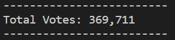
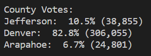
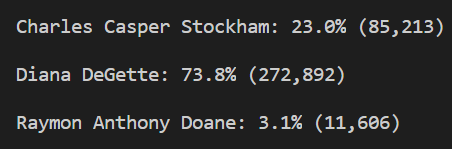
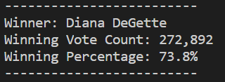

# Election_Analysis
## Project Overview
A Colorado Board of Elections employee has given a task to complete the election audit of a recent local congressional election. The audit is meant to conclude the total votes in this election, the winning candidate (and winning rate) and the winning county (and winning rate)
  
## Resources
- Data Source: election_results.csv  
- Software: Python 3.9.1, Visual Studio Code 2020
  
## Election-Audit Results  
  
- How many votes were cast in this congressional election?  
In total, there were 369,711 votes in this election.  

  
- Provide a breakdown of the number of votes and the percentage of total votes for each county in the precinct.  
The breakdown of county information is shown in the image below:  

- Which county had the largest number of votes?  
Denver had the largest number of votes.  

- Provide a breakdown of the number of votes and the percentage of the total votes each candidate received.  
The breakdown of candidate information is shown in the image below:  

- Which candidate won the election, what was their vote count, and what was their percentage of the total votes?  
Diana DeGette won the election. The vote count is 272,892 and the vote percentage is 73.8%.  

## Election-Audit Summary
If more data is collected, this script is capable to expand the functionality to satisfy more information filtering:  
1. If the party category data is added to the resource file, this script can also conclude the voting results for different parties.  
2. If the age information of voters is added to the resource file, the script can conclude the distribution of different age groups and their preference towards election candidates. Such information can be useful to predict the next election result in the future.
